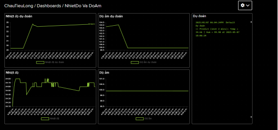

# 📡 Hệ thống Theo Dõi & Quản Lý Nhiệt Độ Phòng Server

## 🔍 Giới thiệu

Trong thời đại công nghệ số, việc giám sát nhiệt độ và độ ẩm của phòng server là cực kỳ quan trọng để đảm bảo hoạt động ổn định của hệ thống máy chủ. Dự án này xây dựng một hệ thống **IoT thông minh**, có khả năng:

- Thu thập và hiển thị dữ liệu nhiệt độ/độ ẩm thời gian thực.
- Cảnh báo khi vượt ngưỡng an toàn qua **Telegram Bot** và **buzzer/LED**.
- **Dự đoán dữ liệu tương lai** bằng mô hình **Random Forest**.
- Hiển thị dữ liệu qua **dashboard trên Adafruit IO**.

> 🛠️ Công nghệ chính: **ESP32**, **DHT22**, **MQTT**, **Adafruit IO**, **Telegram Bot API**, **Machine Learning (Random Forest)**

---

## 👨‍🏫 Thành viên & Hướng dẫn

| Họ và Tên        | MSSV      |
|------------------|-----------|
| Chau Tiểu Long   | 21094341  |
| Nguyễn Nhật Tùng | 21096911  |
| Tống Thành Lộc   | 21105351  |

**Lớp:** DHKHMT17B  
**GV hướng dẫn:** Thầy Nguyễn Ngọc Lễ  
**Trường:** Đại học Công Nghiệp TP.HCM

---

## 🎯 Mục tiêu đề tài

- Thiết kế phần cứng thu thập dữ liệu môi trường.
- Kết nối dữ liệu với nền tảng IoT (Adafruit IO).
- Cảnh báo thời gian thực qua Telegram.
- Xây dựng mô hình học máy để **dự đoán nhiệt độ tương lai**.
- Triển khai thực tế với thiết bị thật.

---

## 🧰 Thiết bị & linh kiện sử dụng

| Thiết bị                 | Mô tả |
|--------------------------|-------|
| ESP32                    | Vi điều khiển hỗ trợ Wi-Fi |
| Cảm biến DHT22           | Đo nhiệt độ và độ ẩm |
| LCD I2C 16x2             | Hiển thị dữ liệu |
| LED đỏ, xanh             | Cảnh báo trực quan |
| Buzzer                   | Cảnh báo âm thanh |
| Nguồn 3.3V – 5V          | Cấp nguồn cho ESP32 và cảm biến |

---

## 🖥️ Sơ đồ kết nối phần cứng

### 💡 Kết nối:

- `DHT22`:
  - DATA → GPIO 4
  - VCC → 3.3V
  - GND → GND

- `LCD I2C`:
  - SDA → GPIO 21
  - SCL → GPIO 22

- `LED`:
  - Đỏ → GPIO 16
  - Xanh → GPIO 18

- `Buzzer` → GPIO 17

### 🖼️ Hình ảnh sơ đồ mạch (thiết kế Wokwi)


> 💡 Để thêm ảnh, bạn hãy đặt hình ảnh trong thư mục `images/` của dự án và dùng cú pháp:
> ```markdown
> 
> ```

---

## 🧑‍💻 Phần mềm & lập trình

### 🔧 Môi trường phát triển:
- **PlatformIO** trên **Visual Studio Code**
- **Wokwi** để mô phỏng
- **Ngôn ngữ lập trình:** C++

### 📚 Thư viện sử dụng:
- `WiFi.h`, `PubSubClient.h`, `DHT.h`, `LiquidCrystal_I2C.h`
- `HTTPClient.h`, `WiFiClientSecure.h`

### ⚙️ Chức năng chính:
- Đọc dữ liệu từ DHT22
- Hiển thị lên LCD I2C
- Gửi dữ liệu lên Adafruit IO mỗi 15 giây (MQTT)
- Gửi cảnh báo Telegram mỗi 60 giây hoặc khi dữ liệu thay đổi bất thường
- Nhấp nháy LED + hú buzzer nếu nhiệt độ > 30°C
- Dự đoán dữ liệu tương lai bằng mô hình **Random Forest**

---

## 🤖 Machine Learning – Dự đoán dữ liệu

Hệ thống sử dụng **Random Forest Regressor** để dự đoán nhiệt độ và độ ẩm 3 phút sau dựa trên dữ liệu lịch sử. Việc dự đoán giúp:

- **Cảnh báo sớm**
- **Điều khiển làm mát chủ động**
- **Tối ưu năng lượng**

---

## 🌐 Gửi dữ liệu lên nền tảng giám sát

### 📦 Adafruit IO
- Tạo 5 Feed: `NhietDo`, `DoAm`, `NhietDoDuDoan`, `DoAmDuDoan`, `DuDoan`
- Dashboard hiển thị biểu đồ tương ứng

### 🤖 Telegram Bot
- Tạo bot với [@BotFather](https://t.me/BotFather)
- Gửi cảnh báo tự động nếu nhiệt độ vượt ngưỡng

---

## 🧪 Kết quả đạt được

- ✅ Gửi dữ liệu và cảnh báo đúng thời gian thực
- ✅ Mô hình AI hoạt động ổn định, dự đoán gần đúng
- ✅ Hiển thị LCD, Telegram, Adafruit IO đồng bộ
- ✅ Hệ thống phản ứng tốt với thay đổi nhiệt độ

---

## 🚧 Hạn chế

- Dữ liệu huấn luyện mô hình chưa phong phú
- Phụ thuộc kết nối Wi-Fi
- Cần chính xác khi đấu nối mạch thật để tránh chập

---

## 🚀 Hướng phát triển

- Tự động điều khiển điều hòa/quạt
- Dùng cloud server để chạy mô hình AI
- Dashboard đẹp hơn (React, Node.js, …)
- Giám sát nhiều điểm bằng nhiều cảm biến (multi-node)

---

## 📚 Tài liệu tham khảo

- [Adafruit IO MQTT](https://io.adafruit.com/api/docs/mqtt.html)
- [Telegram Bot API](https://core.telegram.org/bots/api)
- [ESP32 Documentation](https://docs.espressif.com/)
- [Random Forest in scikit-learn](https://scikit-learn.org/stable/modules/generated/sklearn.ensemble.RandomForestRegressor.html)

---

## 📷 Một số hình ảnh thực tế

### 1. Giao diện Dashboard Adafruit



### 2. Giao diện tin nhắn Telegram


### 3. Mạch đấu nối thực tế


---

## 📝 License

This project is licensed under the [MIT License](LICENSE).

---

